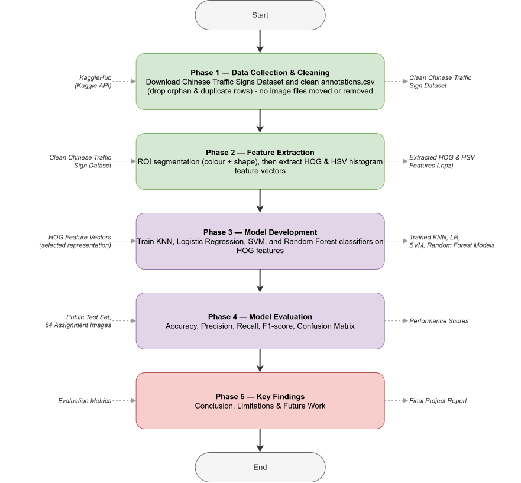

# Traffic Sign Recognition

A classical computer-vision pipeline (no deep learning) that segments Chinese traffic signs by color, extracts hand-crafted HOG and HSV features, and classifies them with KNN, logistic regression and SVM.

## 1. Get Started

This project uses [Nix](https://nixos.org/) + [direnv](https://direnv.net/) for a reproducible dev environment — nothing to install by hand beyond Nix and direnv themselves.

### One-time machine setup (fresh WSL2 Ubuntu)

Follow [khoryz666/nix-template](https://github.com/khoryz666/nix-template) to install Nix and direnv/nix-direnv on a clean machine — it walks through the multi-user Nix daemon install, enabling flakes, and hooking direnv into your shell.

### Per clone

```bash
git clone https://github.com/khoryz666/traffic-sign-recognition.git
cd traffic-sign-recognition
direnv allow   # trust the flake once; the env then auto-loads every time you cd in
```

This provisions Python 3.13 via Nix, then installs everything listed in `requirements.txt` into a project-local `.venv` — automatically, and again whenever `requirements.txt` changes.

### Run the entire pipeline

One command, run from the repo root with the direnv environment loaded, executes all nine notebooks in order (00 → 03) and stops at the first failure:

```bash
for f in 00-dataset/01_download_chinese_traffic_signs.ipynb 00-dataset/02_clean_annotations.ipynb 01-roi-segmentation/01_color_segmentation.ipynb 01-roi-segmentation/02_shape_detection.ipynb 02-feature-extraction/01_hog_features_chinese.ipynb 02-feature-extraction/02_hsv_color_histogram_chinese.ipynb 03-classifier/01_knn_classifier.ipynb 03-classifier/02_logistic_regression_classifier.ipynb 03-classifier/03_svm_classifier.ipynb; do jupyter nbconvert --to notebook --execute --inplace "$f" || break; done
```

### Run notebooks interactively

```bash
jupyter lab
```

Run this from a shell where the environment has loaded (i.e. after `cd`-ing into the repo with direnv active) — or launch your editor (VS Code, etc.) from that same shell so it inherits the environment, with no extra kernel setup needed.

### Adding / removing packages

Edit `requirements.txt`, then re-enter the directory (or run `direnv reload`) — the dev shell reinstalls automatically.

## 2. System Design & Contributors



Source diagram: [`docs/system_design.drawio`](docs/system_design.drawio) (open at [app.diagrams.net](https://app.diagrams.net)).

| Contributor | Contribution |
| :--- | :--- |
| [@khoryz666](https://github.com/khoryz666) | Red color segmentation, HOG feature vectors |
| [@sovaleow](https://github.com/sovaleow) | Shape segmentation/classification, HSV color histogram |
| [@kahyikang](https://github.com/kahyikang) | Yellow color segmentation, SVM classifier |
| [@Ykeattan](https://github.com/Ykeattan) | Blue color segmentation, KNN and logistic regression classifiers |

## 3. Results Overview

The pipeline runs through four numbered stages (`00-dataset/` → `01-roi-segmentation/` → `02-feature-extraction/` → `03-classifier/`), sharing code through the [`pipeline/`](pipeline/) package rather than each notebook redefining its own copy. See the diagram above for the full data/code flow.

### 00 — Dataset

Downloads `dmitryyemelyanov/chinese-traffic-signs` from Kaggle and cleans `annotations.csv`.

| Metric | Value |
| :--- | :--- |
| Images after cleanup | 5,998 |
| Classes | 58 |
| Duplicate annotation rows removed (fresh download) | 166 |
| Orphan annotation rows removed (no matching image) | 0 |
| Held-out assignment-test images (never used for training) | 84 |

### 01 — ROI Segmentation

Demonstrates red/blue/yellow color segmentation and shape classification on the held-out images.

| Metric | Value |
| :--- | :--- |
| Traffic-sign contour detected | 84 / 84 |
| Shape breakdown | Circle 36 · Triangle 18 · Unknown 16 · Octagon 6 · Rectangle 6 · Square 2 |

### 02 — Feature Extraction

Both feature types share one ROI-preprocessing step (segment → crop → resize to 256×256), so they extract from — and drop — exactly the same images.

| Feature set | Dimensions | Train extracted | Test extracted | Held-out extracted |
| :--- | :-: | :-: | :-: | :-: |
| HOG | 1,764 | 4,730 / 4,731 | 1,180 / 1,183 | 84 / 84 |
| HSV histogram | 960 | 4,730 / 4,731 | 1,180 / 1,183 | 84 / 84 |

### 03 — Classifiers

Each classifier is tuned on the training split, evaluated on a stratified 20% test split (1,183 images), and finally evaluated on the fully blind 84-image held-out set.

| Classifier | Best parameters | Test accuracy | Test macro F1 | Held-out accuracy | Held-out macro F1 |
| :--- | :--- | :-: | :-: | :-: | :-: |
| KNN | k=1, euclidean, uniform | 0.9839 | 0.9707 | 0.9881 | 0.9901 |
| Logistic Regression | C=0.1 | 0.9856 | 0.9753 | 0.9881 | 0.9767 |
| SVM | linear, C=10 | 0.9890 | 0.9758 | 0.9881 | 0.9767 |

**What this repo aims to show:** that a fully classical computer-vision pipeline — no deep learning, no pretrained models — can recognize Chinese traffic signs with over 97% accuracy on both an internal test split and a completely held-out blind test set, using only color/shape-based segmentation and hand-crafted HOG/HSV features.
